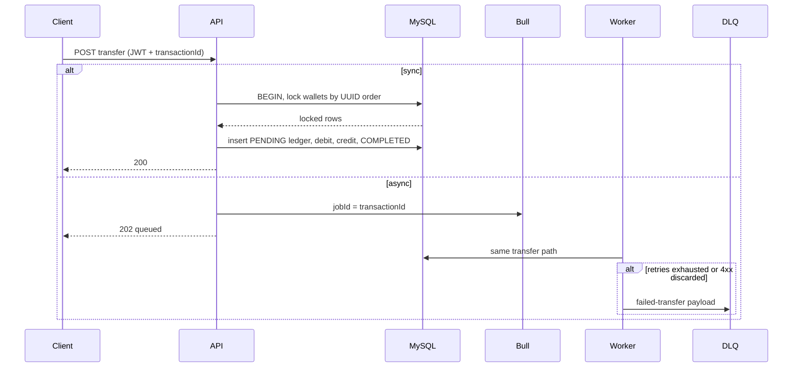

# Architecture

This document describes the **actual** behavior of Pactis Wallet, not a theoretical design. Short versions live in the [README](./README.md).

Static diagram: [docs/architecture.svg](./docs/architecture.svg) · [docs/architecture.png](./docs/architecture.png)

MySQL is the source of truth for users, balances, and the ledger. Redis is the **Bull broker** (including the dead-letter queue). Wallet reads use an **in-process cache-aside** layer — Redis is not the balance store and is not used for arithmetic.

## Authentication

- **Registration** (`POST /api/v1/auth/register`) stores `email` (unique, lowercased) and a **bcrypt** hash (`passwordHash`, 10 rounds). The hash column is `select: false` so it is not loaded on ordinary queries and is never returned in API responses.
- **Login** (`POST /api/v1/auth/login`) compares the password with `bcrypt.compare`. Success returns a signed **JWT access token** (`sub` = user id, `email`). There is no refresh-token rotation; the token TTL comes from `JWT_EXPIRES_IN` (default `24h`).
- **JWT verification** uses `passport-jwt` (`Authorization: Bearer`). `JWT_SECRET` is required in production (16+ characters, not a placeholder). Development/test fall back to a documented insecure default so local Docker and CI can boot.
- Login is rate-limited (5 requests / 60s). Register is rate-limited (10 / 60s).

Unauthenticated calls to wallet and transaction routes return **401**. Health checks are public.

## Authorization

Wallet `userId` is bound at create time to `request.user.userId` from the JWT. Clients cannot supply another user's id.

`WalletAccessService.assertOwned(walletId, userId)` loads the wallet **before** any balance or ledger data is returned:

- missing wallet → **404**
- `wallet.userId !== jwt.sub` → **403 Forbidden**

Ownership is enforced on get wallet, get balance, deposit, withdraw, transfer (source wallet), async transfer, history, stats, and status updates. Transaction lookup is allowed if the caller owns the **source or destination** wallet. List endpoints that used to dump every wallet are scoped to the authenticated user (or removed from the public surface).

Transfers **to** another user's wallet are allowed; only the **source** must be owned.

## Financial correctness

### Optimistic locking (deposit / withdraw)

Deposits and withdrawals touch **one row**. They use optimistic locking on `wallets.version`:

1. Read the wallet (version `N`).
2. Open a transaction, re-load with `lock: { mode: "optimistic", version: N }`.
3. Check `canWithdraw` / `canDeposit`, mutate the in-memory balance, insert the ledger row, `save` the wallet (version becomes `N+1`).
4. If another request committed first, the save fails with `OptimisticLockVersionMismatchError`. The service retries with exponential backoff (3 attempts). On retry it sees the new balance; a second overdraft then fails `canWithdraw`.

The retry loop only retries version conflicts, not business errors.

### Pessimistic locking (transfer)

Transfers must debit A and credit B together. They take `SELECT ... FOR UPDATE` on both wallets, locked in **UUID sort order** (not “from then to”) so `A→B` concurrent with `B→A` cannot deadlock.

After both locks are held: same-currency check, `canWithdraw` / `canDeposit` on the locked snapshots, ledger insert `PENDING`, debit/credit, save both wallets, mark `COMPLETED`.

### Transaction boundaries

Every balance change writes a ledger row in the **same TypeORM/MySQL transaction** as the wallet updates. If anything throws, InnoDB rolls back both. Cache keys are invalidated **only after commit**.

## Idempotency

`transactionId` is the idempotency key. Clients may send it; the API generates one if they do not. The unique index `IDX_transactions_transactionId` is the real lock — not the application-level `findOne`.

1. If a row with that key is already `COMPLETED` **and** `walletId` / `targetWalletId` / `amount` / `type` match, return the original result. A completed key reused with a different payload is **409**.
2. `PENDING` → **409 Duplicate idempotency key**. `FAILED` → **400 Previous transaction attempt failed** (replay with a **new** key).
3. Otherwise insert `PENDING` inside the DB transaction. A racing second insert hits MySQL `ER_DUP_ENTRY` (1062). The loser is mapped to 409, or to the idempotent success path if the winner already committed `COMPLETED` with the same payload.
4. Deposit and withdraw accept the same optional `transactionId`. Transfers also reject `amount <= 0` and mismatched currencies **in the service** (not only via DTO validation), so a Bull worker cannot mint money from poisoned Redis JSON.
5. Async jobs use the same value as Bull `jobId`. Re-enqueueing the same key is a no-op at the queue layer as well.

## Failure recovery

Bull delivers **at-least-once**. The transfer body is one MySQL transaction:

| Failure | What happens |
|---|---|
| Worker crash **before** commit | InnoDB rolls back. No ledger row, no balance change. Bull retries the same `jobId` / `transactionId`. |
| Worker crash **after** commit, before ack | Bull retries. The retry finds the `COMPLETED` row and returns it without moving money again. |
| Infra / 5xx error | 3 attempts, exponential backoff (2s, 4s, 8s), then DLQ. |
| Business / 4xx error | `job.discard()` — **not** retried. Copied to `transactions-dlq`. A `FAILED` ledger row is written when the source wallet exists. |

`transactionId` is stamped **before** enqueue. Generating it inside the worker would double-spend on retry.

`GET /api/v1/transactions/get-failed-transactions` lists **the caller's** failed ledger rows. Redis holds the DLQ job payload. Replay uses a **new** `transactionId`.

## Caching

- **Pattern:** cache-aside for wallet documents (`wallet:{id}`) and balances (`wallet:balance:{id}`).
- **Store:** in-process `cache-manager` (TTL 5 minutes on those keys). Redis is **not** the cache backend in this project; it is the Bull broker.
- **Invalidation:** after a successful commit. Transfers invalidate **both** wallets. A cache hit is an optimization; a miss always reads MySQL.
- MySQL remains the source of truth. A process restart loses the in-memory cache; that is acceptable for a single API instance.

## Money representation

Amounts are stored as MySQL `decimal(15,2)`. The TypeORM transformer parses them to JavaScript `number`. Mutations use `Math.round(x * 100) / 100`.

**Why not integer cents?** Migrating every entity, DTO, ledger row, cache payload, and e2e assertion is a data-model change with real conversion risk. For this portfolio size the decimal + rounding strategy is explicit, tested at cent boundaries (0.1+0.2, hundred 0.01 withdrawals), and documented. Integer minor units remain a valid production evolution — they are not claimed here.

JavaScript `number` cannot represent every decimal exactly. The rounding step is a **mitigation**, not a substitute for a money library or integer cents in a high-throughput payments system.

## How money moves (sequence)

## Optimistic vs pessimistic locking

| Operation | Lock | Why |
|---|---|---|
| Deposit / withdraw | Optimistic (`version`) | Single row. Conflicts are rare; retry is cheaper than holding row locks. |
| Transfer | Pessimistic `SELECT ... FOR UPDATE` | Two rows must stay consistent. Lost-update is unacceptable. |

## What we explicitly do not do

- Redis is not a distributed lock for balances and is not the wallet cache.
- The queue is not a ledger. Jobs are commands; MySQL records facts.
- There is no refresh-token family, no Kafka, no Kubernetes, no claimed production SaaS deployment.
