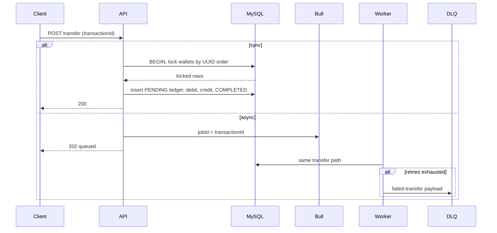

# Architecture

This document explains the concurrency, idempotency, crash-recovery, and locking decisions in Pactis Wallet. The short versions live in the [README](./README.md); this is the design rationale.

MySQL is the source of truth for balances and the ledger. Redis is a cache and a Bull broker — never the balance store.

## How money moves

Every balance change writes a ledger row in the **same database transaction** as the wallet updates. If anything throws, TypeORM rolls back both. Cache keys for that wallet are invalidated only after commit.

## Preventing two withdrawals from spending the same balance

Deposits and withdrawals touch **one row**. They use optimistic locking on `wallets.version`:

1. Read the wallet (version `N`).
2. Open a transaction, re-load with `lock: { mode: "optimistic", version: N }`.
3. Check `canWithdraw` / `canDeposit`, mutate the in-memory balance, insert the ledger row, `save` the wallet (version becomes `N+1`).
4. If another request committed first, the save fails with a version mismatch. The service retries with exponential backoff (3 attempts). On retry it sees the new balance; a second overdraft then fails `canWithdraw`.

That is cheaper than holding `FOR UPDATE` on a hot wallet under deposit load. The retry loop only retries version conflicts, not business errors (insufficient funds, inactive wallet).

Transfers cannot use that model: they must debit A and credit B together. See pessimistic locking below.

## Idempotency

`transactionId` is the idempotency key. Clients may send it; the API generates one if they do not. The unique index `IDX_transactions_transactionId` is the real lock — not the pre-check.

Protocol:

1. If a row with that key is already `COMPLETED`, return the original result (safe client retry).
2. If it is `PENDING` or `FAILED`, reject with `409 Conflict` / `400` so the client cannot accidentally replay a failed attempt under the same key.
3. Otherwise insert `PENDING` inside the DB transaction. A racing second insert hits `ER_DUP_ENTRY` (MySQL 1062). The loser is mapped to `409 Conflict`, or, if the winner already committed `COMPLETED`, to the idempotent success path.
4. Async jobs use the same value as Bull `jobId`. Re-enqueueing the same key is a no-op at the queue layer as well.

The application-level `findOne` before the transaction is a fast path, not a correctness guarantee. Correctness comes from the unique index plus insert-inside-the-transaction.

## Worker crash halfway through

Bull delivers **at-least-once**. The transfer body is a single MySQL transaction, so a crash mid-handler cannot leave “debited A, not credited B”:

- Crash before commit → InnoDB rolls back. No ledger row, no balance change. Bull retries the same `jobId` / `transactionId`. The retry runs a fresh transfer.
- Crash after commit, before the job is acknowledged → Bull retries. The retry finds the `COMPLETED` row and returns it without moving money again.

That only works if the idempotency key exists **before** the first attempt. `processTransferAsync` stamps `transactionId` and passes it as `jobId` at enqueue time. Generating the key inside the worker would double-spend on retry.

## Recovering failed transactions

1. **Retry.** Transfer jobs use 3 attempts with exponential backoff (2s, 4s, 8s). Transient DB/Redis blips succeed on a later attempt.
2. **Dead-letter.** When `attemptsMade >= attempts`, `TransactionProcessor.handleFailed` copies the payload and error onto `transactions-dlq` (`failed-transfer`) and calls `markTransactionFailed` if a `PENDING` ledger row still exists.
3. **Inspect.** `GET /api/v1/transactions/get-failed-transactions` lists failed ledger rows. Bull Board / Redis CLI can inspect the DLQ.
4. **Replay.** Replay is intentional: enqueue a **new** `transactionId` (or an admin tool). Silent auto-replay of a DLQ item with the same key would either 409 or no-op, depending on status.

`removeOnFail` is `false` on async transfers so exhausted jobs remain until they are moved to the DLQ.

## Optimistic vs pessimistic locking

| Operation | Lock | Why |
|---|---|---|
| Deposit / withdraw | Optimistic (`version`) | Single row. Conflicts are rare; retry is cheaper than holding row locks. |
| Transfer | Pessimistic `SELECT ... FOR UPDATE` | Two rows must stay consistent. Lost-update is unacceptable. |

Transfers lock the two wallets in **UUID sort order**, not “from then to”. `A→B` concurrent with `B→A` would otherwise deadlock (each holds one row and waits for the other). After both locks are held, `canWithdraw` / `canDeposit` run on the locked snapshots, then the ledger insert, then both saves, then `COMPLETED`.

## Cache and decimals

- Redis cache-aside for wallet documents and balances. TTL 5 minutes. **Invalidate after commit**, never before — including both wallets on a transfer. A cache hit is an optimization; a miss always reads MySQL.
- Amounts are `decimal(15,2)`. The entity transformer and `Math.round(x * 100) / 100` keep JS floats from drifting. Redis is not used for arithmetic.

## What we explicitly do not do

- Redis is not a distributed lock for balances.
- The queue is not a ledger. Jobs are commands; MySQL records facts.
- Failed business rules (insufficient funds) still throw. Bull will retry them on the async path; operators should treat repeated 400s on the DLQ as poison messages, not infrastructure failures.
