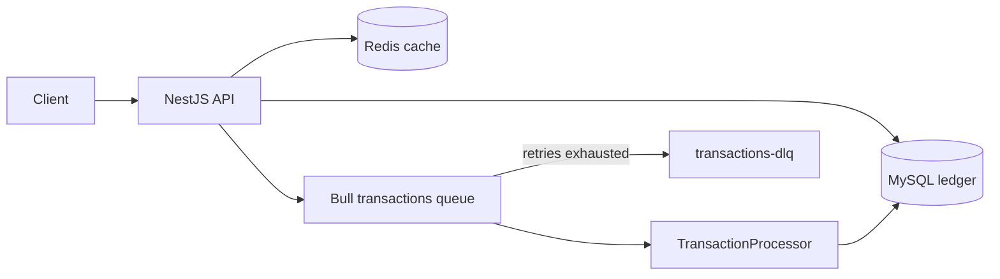

# Pactis Wallet

A NestJS wallet API that treats money movement as a hard concurrency problem: double-spend, duplicate requests, worker crashes, and failed jobs.

Balances live in MySQL. Every deposit, withdrawal, and transfer writes a ledger row in the **same database transaction** as the balance update. Transfers are idempotent (`transactionId` unique key). Background transfers run on Bull with retries and a dead-letter queue.

Longer design notes: [ARCHITECTURE.md](./ARCHITECTURE.md).

## Architecture



| Piece | Role |
|---|---|
| NestJS API | Wallet CRUD, deposit, withdraw, sync/async transfer |
| MySQL | Source of truth: `wallets.balance` + `wallets.version`, unique `transactions.transactionId` |
| Redis | Cache-aside for reads; Bull broker. Never the balance store |
| Bull worker | At-least-once async transfers; same `transfer()` path as the HTTP API |
| DLQ | Exhausted jobs copied to `transactions-dlq` for inspection |

### How money moves

- **Deposit / withdraw** — optimistic lock on `wallets.version`. Conflict → retry → re-read balance. Ledger row uses the same TypeORM `EntityManager` as the wallet `save`.
- **Transfer** — `SELECT ... FOR UPDATE` on both wallets, locked in UUID order to avoid deadlocks, then debit + credit + ledger in one transaction.
- **Idempotency** — unique `transactionId`. Completed replay returns the original result. A racing insert is rejected (`409`).
- **Async transfer** — `transactionId` is assigned **before** enqueue and used as Bull `jobId`, so a worker retry cannot double-spend.

## Hard problems

Full answers in [ARCHITECTURE.md](./ARCHITECTURE.md).

**How do you prevent two simultaneous withdrawals from spending the same balance?**
Optimistic locking on `wallets.version`. Only one `UPDATE ... WHERE version = N` wins. The loser retries, sees the new balance, and fails `canWithdraw` if funds are gone. Transfers instead take `FOR UPDATE` on both rows because two wallets must stay consistent together.

**How does idempotency work?**
`transactionId` is a client- or server-generated unique key. The MySQL unique index is the source of truth, not the pre-check. A completed replay returns the original transaction. A concurrent insert hits `ER_DUP_ENTRY` and becomes `409`. Async jobs use that same value as Bull `jobId`.

**What happens when the worker crashes halfway through?**
The debit, credit, and ledger write are one MySQL transaction — they all commit or all roll back. Bull is at-least-once: a retry after a successful commit finds the `COMPLETED` row and no-ops. That requires the idempotency key to exist at enqueue time, not inside the worker.

**How do you recover failed transactions?**
Three attempts with exponential backoff. After exhaustion the job is copied to `transactions-dlq` and any still-`PENDING` ledger row is marked `FAILED`. Replay is a conscious re-enqueue with a **new** key, not a silent retry of the DLQ item.

**Why optimistic vs pessimistic?**
Deposits and withdrawals touch one row; conflicts are rare, so optimistic + retry is cheaper than holding row locks. A transfer must debit A and credit B atomically, so it uses `FOR UPDATE` plus ordered lock acquisition to prevent lost updates and deadlocks.

## Tests that prove it

```bash
npm test          # unit tests (no Docker)
npm run test:e2e  # concurrency + real Bull retry/DLQ (MySQL + Redis)
```

| Test | What it proves |
|---|---|
| should create wallet | Unique `userId`; initial balance + ledger in one transaction |
| should deposit funds | Balance increases; ledger written via the same `EntityManager` |
| should withdraw funds | Balance decreases; withdrawal ledger row |
| should reject insufficient balance | `canWithdraw` fails; no ledger write |
| should transfer funds | Pessimistic locks, both balances move, status `COMPLETED` |
| should reject duplicate idempotency key | Unique `transactionId` → `409`; balances unchanged |
| should rollback failed transaction | Error after mutations propagates; the DB transaction does not return success |
| should handle concurrent transfers | Two 80-unit transfers from a 100-unit wallet: exactly one wins; opposite-direction pair does not deadlock |
| should retry failed background job | Processor/Bull: fail twice, succeed on the third attempt |
| should move permanently failed job to DLQ | After 3 failures the payload lands on `transactions-dlq` |

E2E tests skip (with a warning) if MySQL or Redis is not reachable. Start them with:

```bash
docker compose up -d mysql redis
npm run test:e2e
```

## Tech stack

NestJS, TypeScript, MySQL 8 (TypeORM), Redis (cache-manager + Bull), class-validator, Swagger.

## Run locally

**Prerequisites:** Node.js 18+, Docker (MySQL 8 + Redis 7).

```bash
git clone <repository-url>
cd Pactis-wallet
cp env.example .env
docker compose up -d mysql redis
npm install
npm run start:dev
```

`docker compose up -d` also starts the API container if you want the full stack; for local `start:dev`, only `mysql` and `redis` are required.

- API: http://localhost:3000
- Swagger: http://localhost:3000/api/v1
- Health: http://localhost:3000/api/v1/health

If you prefer a host MySQL instead of Docker, create the schema once:

```bash
mysql -u root -p -e "CREATE DATABASE wallet_system;"
mysql -u root -p wallet_system < src/database/migrations/001-create-wallets-table.sql
```

## API

Global prefix: `/api/v1`. Paths match the controllers (not a cleaned-up facade).

### Wallets

**Create wallet**
```http
POST /api/v1/wallets/create-wallet
Content-Type: application/json

{
  "userId": "user123",
  "initialBalance": 100.00,
  "currency": "USD"
}
```

**Get wallet** — `GET /api/v1/wallets/get-wallet/{walletId}`

**Get wallet by user** — `GET /api/v1/wallets/get-wallet-by-user/{userId}`

**Get balance** — `GET /api/v1/wallets/get-wallet-balance/{walletId}`

**Deposit**
```http
POST /api/v1/wallets/deposit
Content-Type: application/json

{
  "walletId": "wallet-uuid",
  "amount": 50.00,
  "description": "Salary deposit"
}
```

**Withdraw**
```http
POST /api/v1/wallets/withdraw
Content-Type: application/json

{
  "walletId": "wallet-uuid",
  "amount": 25.00,
  "description": "ATM withdrawal"
}
```

**Update status** — `PUT /api/v1/wallets/update-wallet-status/{walletId}` with `{ "status": "suspended" }`.

### Transactions

**Transfer (sync)**
```http
POST /api/v1/transactions/transfer
Content-Type: application/json

{
  "fromWalletId": "wallet-uuid-1",
  "toWalletId": "wallet-uuid-2",
  "amount": 100.00,
  "description": "Payment for services",
  "transactionId": "optional-idempotency-key"
}
```

**Transfer (async)** — `202 Accepted`. Same body as above. The response includes the stamped `transactionId`.

```http
POST /api/v1/transactions/transfer-async
```

**History** — `GET /api/v1/transactions/get-transaction-history?walletId={walletId}&page=1&limit=20`

**Get one** — `GET /api/v1/transactions/get-transaction/{transactionId}`

**Stats** — `GET /api/v1/transactions/get-transaction-stats/{walletId}`

**Failed / pending** — `GET /api/v1/transactions/get-failed-transactions`, `GET /api/v1/transactions/get-pending-transactions`

## License

MIT
