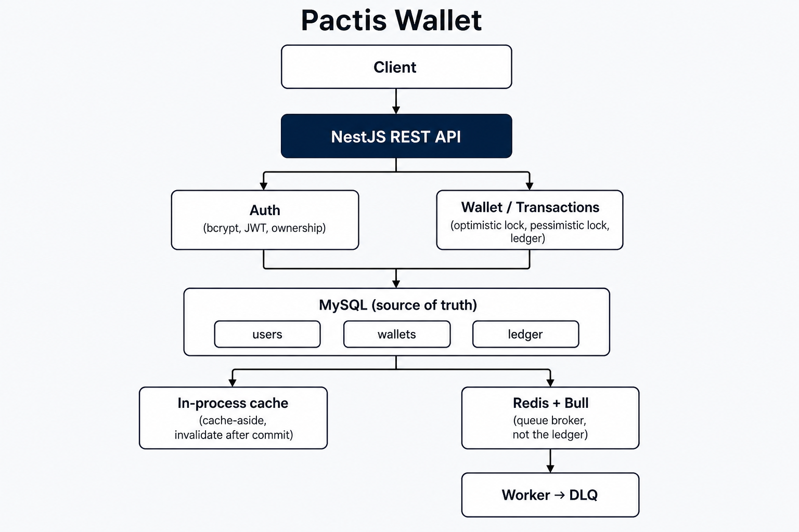

# Pactis Wallet

A production-oriented NestJS wallet API focused on financial correctness, concurrency control, idempotency, and reliable asynchronous transaction processing.

[](https://github.com/eunicegigijacob/Pactis-wallet/actions)
[](./ARCHITECTURE.md)
[](https://www.typescriptlang.org/)
[](https://nestjs.com/)
[](./docker-compose.yml)



Longer design notes: [ARCHITECTURE.md](./ARCHITECTURE.md) · SVG diagram: [docs/architecture.svg](./docs/architecture.svg)

## Why this project exists

Moving money is not CRUD. Two withdrawals can race. A client can retry a transfer. A worker can crash after debiting one wallet. This project is a small, interview-explainable NestJS service that treats those problems as the product: locking, a ledger, idempotency keys, retries, and a dead-letter queue.

## Key engineering challenges

| Challenge | What the code does |
|---|---|
| Double-spend | Optimistic version checks on deposit/withdraw; `FOR UPDATE` on transfers |
| Concurrent transactions | UUID-ordered wallet locks so opposite-direction transfers cannot deadlock |
| Idempotency | Unique `transactionId`; matching replay returns the original result; mismatched payload is 409 |
| Atomicity | Balance updates and ledger inserts share one MySQL transaction |
| Worker failure | Crash before commit rolls back; crash after commit is a no-op replay |
| Retries / DLQ | Exponential backoff for infra errors; 4xx discarded; exhausted jobs go to `transactions-dlq` |
| Cache consistency | Cache-aside; invalidate after commit (both wallets on transfer) |
| Authorization | JWT + ownership checks before returning or mutating a wallet |

## Architecture

```
Client
  → NestJS REST API
       → Auth (bcrypt, JWT, ownership)
       → Wallet / Transactions
            → MySQL (users, wallets, ledger)
            → In-process cache (cache-aside)
            → Redis + Bull → Worker → DLQ
```

MySQL is the source of truth. Redis is the Bull broker, not the balance store.

## Concurrency strategy

```
Deposit / Withdraw
  → Optimistic locking on wallets.version
  → Retry version conflicts (not business errors)

Transfer
  → Pessimistic locking (SELECT ... FOR UPDATE)
  → Deterministic lock order (sort wallet UUIDs)
```

## Idempotency

`transactionId` is a client- or server-generated key with a unique MySQL index.

- First request writes `PENDING` inside the same DB transaction as the balance change, then `COMPLETED`.
- A **completed** replay with the same wallets/amount/type returns the original result.
- The same key with a **different** payload is `409`.
- A **failed** key cannot be reused; send a new `transactionId`.
- Async transfers stamp `transactionId` **before** enqueue and use it as the Bull `jobId`.

## Async processing

```
API  →  Bull (jobId = transactionId)  →  Worker (same transfer())
                                         → retry (exponential backoff)
                                         → DLQ when attempts are exhausted or 4xx is discarded
```

## Security

- **JWT** access tokens after login (`Authorization: Bearer`)
- **bcrypt** password hashes; plaintext is never stored
- **Ownership** checks on wallet and transaction routes (403 if the wallet belongs to someone else)
- **Rate limiting** on login, deposit, withdraw, transfer, and async transfer
- **DTO validation** (`whitelist` + `forbidNonWhitelisted`)
- **Sanitized errors** — unknown failures become `500 Internal server error`; SQL and stacks stay in logs

## Testing

```bash
npm test          # unit tests (no Docker)
npm run test:e2e  # concurrency, auth/ownership, Bull retry/DLQ (MySQL + Redis)
```

E2E tests **fail** if MySQL or Redis is not reachable.

| Area | What is covered |
|---|---|
| Auth | Register, login, invalid password, 401 without a token |
| Authorization | Owner can read/mutate; another user gets 403 |
| Financial | Insufficient funds, atomic transfer, forced rollback, concurrent withdraw/transfer, opposite-direction no deadlock |
| Idempotency | Duplicate key, completed matching replay, failed replay, racing unique index |
| Queue | Retry then success, permanent failure → DLQ, 4xx discard |
| Cache | Hit, miss, invalidation after deposit, both wallets after transfer |

## API

Global prefix `/api/v1`. Swagger UI at http://localhost:3000/api/v1 is the full route catalog (Authorize with the login token). Core routes:

### Auth (public)

```http
POST /api/v1/auth/register
{ "email": "ada@example.com", "password": "correct-horse" }

POST /api/v1/auth/login
{ "email": "ada@example.com", "password": "correct-horse" }
```

Login returns `{ accessToken, tokenType, expiresIn, user }`. Send `Authorization: Bearer <accessToken>` on the routes below.

### Wallets (JWT)

```http
POST /api/v1/wallets/create-wallet
{ "initialBalance": 100.00, "currency": "USD" }

GET  /api/v1/wallets/get-wallet/{walletId}
GET  /api/v1/wallets/get-wallet-balance/{walletId}

POST /api/v1/wallets/deposit
{ "walletId": "...", "amount": 50.00, "transactionId": "optional-key" }

POST /api/v1/wallets/withdraw
{ "walletId": "...", "amount": 25.00 }
```

`userId` is taken from the JWT, not the body.

### Transactions (JWT)

```http
POST /api/v1/transactions/transfer
{ "fromWalletId": "...", "toWalletId": "...", "amount": 100.00, "transactionId": "optional-key" }

POST /api/v1/transactions/transfer-async   # 202 Accepted; same body

GET  /api/v1/transactions/get-transaction-history?walletId={walletId}
GET  /api/v1/transactions/get-transaction/{transactionId}
```

### Health (public)

```http
GET /api/v1/health
```

## Run locally

**Prerequisites:** Node.js 18+, Docker (MySQL 8 + Redis 7).

```bash
git clone <repository-url>
cd Pactis-wallet
cp env.example .env
docker compose up -d mysql redis
npm install
npm run start:dev
```

- API: http://localhost:3000
- Swagger: http://localhost:3000/api/v1
- Health: http://localhost:3000/api/v1/health

Full stack (API in Docker as well):

```bash
docker compose up --build
```

The Docker API image listens on `0.0.0.0:$PORT`. `JWT_SECRET` is set in `docker-compose.yml` for local use; do not reuse that value in a real deployment.

## Design decisions

- **Optimistic vs pessimistic:** one-row mutations retry cheaply; two-row transfers must not lose updates, so they lock.
- **UUID lock order:** prevents deadlocks when A pays B while B pays A.
- **Idempotency in the database:** a unique index survives process crashes; an in-memory map would not.
- **Stamp `transactionId` before enqueue:** at-least-once workers must replay the same key.
- **Decimal amounts, not integer cents:** `decimal(15,2)` plus rounding is the current model; a cents migration was judged higher risk than value for this repo size. See [ARCHITECTURE.md](./ARCHITECTURE.md).
- **In-process cache:** Redis is already the queue broker. Claiming a Redis cache that the code does not use would be dishonest.

## Future improvements

- Integer minor units (cents) as the internal money type
- Redis-backed cache if the API is scaled past one process
- Outbox / replay tooling for DLQ operators
- Stronger password policy and lockout beyond rate limits

## License

MIT
